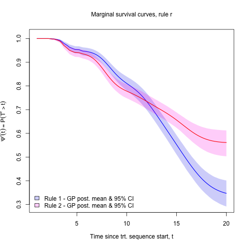

# Bayesian Semiparametric Analysis of Dynamic Treatment Regimes

## Summary
This repository contains sample R code for Bayesian semiparametric analysis of dynamic treatment regimes via the Gamma Process models developed here: https://doi.org/10.1093/biostatistics/kxad035

Slightly outdated arxiv version here: https://arxiv.org/abs/2211.16393

## Citation
Please use the following .bib citation if you are using LaTeX:
```
@article{Oganisian2024,
    author = {Oganisian, Arman and Getz, Kelly D and Alonzo, Todd A and Aplenc, Richard and Roy, Jason A},
    title = {Bayesian semiparametric model for sequential treatment decisions with informative timing},
    journal = {Biostatistics},
    volume = {25},
    number = {4},
    pages = {947-961},
    year = {2024},
    month = {01},
    issn = {1465-4644},
    doi = {10.1093/biostatistics/kxad035}
}

``` 

## File Description and Instructions

The main analysis file is `run_bsp_models.R`, which takes as input the dataset `data/sample_data.Rdata` and (1) runs Bayesian semi-parametric models and (2) Bayesian g-computation procedure - both described in the associated paper. See comments in `run_bsp_models.R` for a detailed description of the data structure and variable names in `sample_data.Rdata`. Briefly, it contains data on 1,000 subjects who undergo a maximum of four treatment courses along with four baseline covariates and two time-varying covariates.

Part (1) is done by calling the function `bayes_dtr_mcmc()` contained in the file `helper_functions/bayes_dtr_mcmc.R` which runs the MCMC algorithm and outputs posterior draws of the model parameters. The function `bayes_dtr_mcmc()` in turn depends on several helper functions (e.g.such as conditional posteriors) contained in `helper_functions/mcmc_helpers.R`. `bayes_dtr_mcmc()` will print progress updates every 1,000 iterations.

Part (2) uses the posterior draws from (1) to evaluate the causal effect of a specified dynamic treatment rule (DTR) via a g-computation procedure. This is done via the `gcomp_bayes()` function contained in `helper_functions/gcomp_bayes.R`.

The file `run_bsp_models.R` runs the gcomp procedure under two specified rules and then plots the marginal survival curve under each. This is contained in `output/survivalplots.png`:


Optimization can be done by looping `gcomp_bayes()` across a series of rules.

## Runtime
The run-time for `bayes_dtr_mcmc()` is about 12 minutes for the given data set containing 1,000 subjects with 10,000 total iterations and the following session info. Under the same settings, the run time for `gcomp_bayes()` is about 1.5 minutes per rule.

```
R version 4.1.0 (2021-05-18)
Platform: x86_64-apple-darwin17.0 (64-bit)
Running under: macOS Big Sur 11.7.4
```

## Contact
Corresponding Author: Arman Oganisian (email:arman_oganisian@brown.edu)
